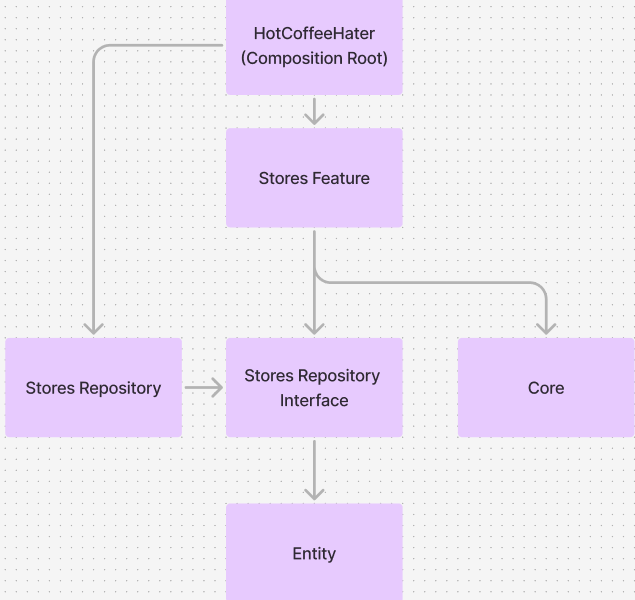

# 얼죽아 (HotCoffeeHater)

## Tuist 버전 관리

- mise를 통해 Tuist 버전 통일
- 사용 버전: 4.27.0

## 모듈 구조

### Stores Feature

- UIKit, SwiftUI 두 가지 버전으로 만들 예정
- Repositry에 DIP 원칙을 적용해서 Stores Feature를 테스트 용이하게 구현

## 의존성 다이어그램

